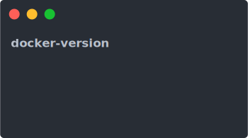

# Docker Version [](https://www.npmjs.com/package/docker-version-cli)

> A simple Docker tagging and publishing tool

<p align="center">
	<br>
	
	<br>
</p>

## Install

```bash
$ npm i docker-version-cli -g
```
or

```bash
$ yarn global add docker-version-cli
```

## Usage

```bash
$ docker-version --help
Usage: docker-version [options]

Options:
  -V, --version      output the version number
  -n, --name [name]  Docker images name (default: "")
  -t, --tag [tag]    Docker images tag/version (default: "")
  -h, --help         output usage information
```

## Configuration

put `.docker-version` file into your docker project

```bash
$ cat .docker-version

php:latest-fpm-alpine
php:latest-cli-alpine
```

### Example

pull alpine:latest and tag 3.8, 3, current for it.

```bash
$ docker-version -n alpine:latest -t 3.8

[success] pull alpine:latest
[success] tag alpine:3.8
[success] push alpine:3.8
[success] tag alpine:3
[success] push alpine:3
[success] tag alpine:current
[success] push alpine:current
```

or interactive

```bash
$ docker-version

? what is your docker images name? alpine:latest
? what is your docker images latest version? 3.8

[success] pull alpine:latest
[success] tag alpine:3.8
[success] push alpine:3.8
[success] tag alpine:3
[success] push alpine:3
[success] tag alpine:current
[success] push alpine:current
```
